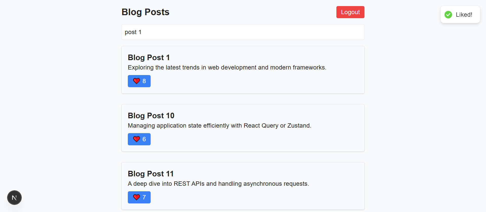

# Blog Mock DMACQ

A **mock blogging application** built with **Next.js**, **TypeScript**, and **Tailwind CSS**. This project simulates a simple blog platform with posts, users, and API endpoints using mock JSON data.

---

## Table of Contents

1. [Features](#features)
2. [Technologies](#technologies)
3. [Screenshots](#screenshots)
4. [Getting Started](#getting-started)
5. [Project Structure](#project-structure)
6. [API Endpoints](#api-endpoints)
7. [Mock Data](#mock-data)
8. [Scripts](#scripts)
9. [Contributing](#contributing)
10. [License](#license)

---

## Features

- List and view blog posts
- Mock users support
- Simple API endpoints for posts and users
- Fully typed with TypeScript
- Tailwind CSS styling
- Mock data for development/testing

---

## Technologies

- **Next.js** – React framework for SSR
- **TypeScript** – Static typing for JavaScript
- **Tailwind CSS** – Utility-first CSS framework
- **PostCSS** – CSS transformations
- **Jest** – Testing framework (optional)
- **ESLint** – Code linting (optional)

---

## Screenshots

### Home Page


### Blogs Page


### Blog Like Toast



### Blog Infinite Scroll


### API Response Example


> Replace the above image paths with your actual screenshots.

---

## Getting Started

### Prerequisites

- Node.js >= 18
- npm >= 9

### Installation

```bash
git clone https://github.com/ajay-anand-dev/blog_mock_dmacq.git
cd blog_mock_dmacq
npm install
```
